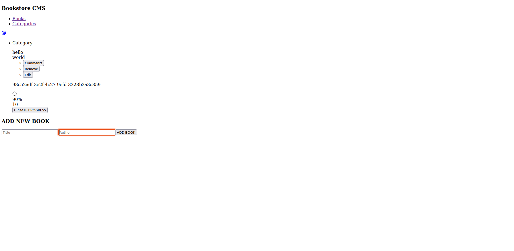

# BookStore
* This project was created using React and Redux, it renders functional components, it routes between paths so it can be displayed as a single page application. The BookList App is a single page aplication that has 2 page components routed by the main app component, one of the components runs a react component Books page which calls BookList component, the BookList component fetch the books array by using a selector to fetch from the redux store.



## Built With

- Html, Javascript, CSS
- Webpack
- React JS
- Redux
- Developed in VSCode

## Setup 
### clone repository
```bash
$ git clone git@github.com:JbirdL86/Bookstore.git
```
### Start Project
```bash
$ cd Bookstore 
-Install node_modules
-run yarn
$ yarn start
```

### Author 🤝:
* Juan Luis Gonzalez 
- Github: [@githubhandle](https://github.com/JbirdL86)
- Twitter: [@twitterhandle](https://twitter.com/JuanLui06498455)
- Linkedin: [linkedin](https://www.linkedin.com/in/juan-luis-0551921aa/)

## 🤝 Contributing

Contributions, issues, and feature requests are welcome!